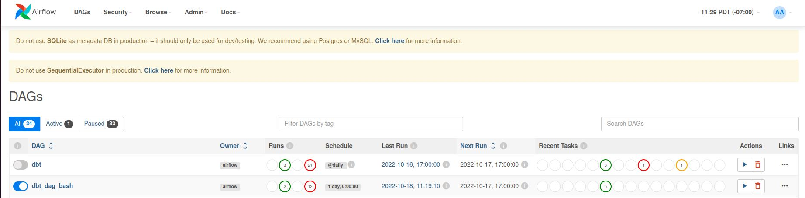

# Airflow_dbt

Using Airflow as an orchestrator and using dbt for transformations.

### Table of Contents

- [Overview](#overview)
- [Airflow](#airflow)
- [Data Build Tool](#data-build-tool)
- [Folder Structure](#folder-structure)
- [Program Flow](#program-flow)
- [Program Execution](#program-execution)
- [Data Model](#data-model)
- [Level Up](#level-up)
- [Documentation and Material](#documentation-and-material)
- [Tools and Technologies](#tools-and-technologies)

---


### Overview

- The purpose of doing this was to learn how the **Tranformations** step can be made easy using data build tool (dbt) and to use airflow to orchestrate.
- Check what different functionalities does dbt support that can save development time.
- Snowflake was used as a warehouse. Free 30 day trail when you sign up.


---

### Airflow

- Apache Airflow is an open-source platform for developing, scheduling, and monitoring batch-oriented workflows.
- Airflow’s extensible Python framework enables you to build workflows connecting with virtually any technology.
- A web interface helps manage the state of your workflows.
- Follow these steps to execute dbt jobs using dbt.

#### Airflow Installation
- Python, git should be installed.

- This will create a virtual env
```bash
  python3 -m venv airflow_env
```

- Activate the env
  - Remember to be in the correct folder. 
```bash
  source airflow_env/bin/activate
```

- Update and install some packages
```bash
  sudo apt-get update
```
```bash
  sudo apt-add-repository universe
```
```bash
  sudo apt-get update
```
```bash
  sudo apt-get install python-setuptools
```
```bash
  sudo apt install python3-pip
```
```bash
  sudo apt-get install libmysqlclient-dev
```
```bash
  sudo apt-get install libssl-dev
```

- If you some other folder name do change its name.
```bash
  export AIRFLOW_HOME=~/<airflow-folder-name>
```
- Install airflow
```bash
  pip3 install apache-airflow
```
```bash
  pip3 install typing_extensions
```
- Installing this will allow to use DbtOperators to execute the code else you can use the BashOperator as well. Documentation Attached in documentation section.
```bash
  pip install airflow-dbt
```

- Initialize the airflow database
```bash
  airflow db init
```
- In case you face some issue with the above command use the following command
```bash
  airflow db reset
```

- Create user and will prompt for password that will be used in the UI.
```bash
  airflow users create --username admin --firstname admin --lastname testing --role Admin --email admin@domain.com
```

- Start the scheduler and webserver
```bash
  airflow scheduler
```
```bash
  airflow webserver
```

- I had created a DAG by the name of dbt and that use the Dbt Operator to run the tasks.
- The other one dbt_dag_bash is using the BashOperator to orchestrate and execute it.
<p align="center">
  
</p>


---

### Data Build Tool

- dbt enables analytics engineers to transform data in their warehouses by simply writing **select statements**.
- dbt handles turning these select statements into **tables** and **views**. These tables can be incremental can dbt will handle that.
- dbt does the T in ELT (Extract, Load, Transform) processes.
- dbt provides a web UI that can be used to visualize the lineage and dependency of models.
- dbt web UI also provides detail about each model and what it depends on as well the as test cases on certain models.

<p align="center">
  
</p>

#### dbt Installation

- Install git and python. 
- dbt installation on Linux has some problem and due to that we need install the dbt-core project.
- Will be doing this all in a virtual environment.

- Activate the env
  - Remember to be in the correct folder. 
```bash
  source airflow_env/bin/activate
```

- Some dependency
```bash
  pip install pyOpenSSL==22.0.0
```
- Install Dbt 
```bash
  pip install dbt-core==1.1.0
```
- Install DB/DWH of your choice using Snowflake here.
```bash
  pip install dbt-snowflake==1.1.0
```

- Command to verify dbt installed.
```bash
  dbt --version
```

- Download the Snowflake Plugin if not specified in the requirements.txt file
```bash
  pip install dbt-snowflake
```

- Open your choice of editor, VS Code used in this demo. Running the command will populate with different folders (seeds, models etc)
```bash
  dbt init <project-name>
```

#### Connecting dbt with Snowflake

- Snowflake provides 30 day free trail.
- When dbt installed and configured, in home directory a **.dbt** will be visible.
- Two file will be present.
  - profile.yml
  - .user.yml
- In the **profile.yml** we provide our Snowflake credentials. Refer to dbt documentation.
- https://docs.getdbt.com/reference/warehouse-profiles/snowflake-profile
```bash
dbt_model:
  outputs:
    dev:
      account: ap12345.ap-south-1.aws
      database: <database>
      password: <password>
      role: <role-from-snowflake>
      schema: <schema>
      threads: 2
      type: snowflake
      user: <username>
      warehouse: <warehouse-name-from-snowflake>
  target: dev
```

- When snowflake profile has been set, run the command to check the connection.
```bash
  dbt debug
 ```

---


### Folder Structure
- dags &emsp;&emsp;&emsp;&nbsp;&nbsp;&nbsp; - Write/Paste dag code here.    
- dbt_project &emsp;&nbsp;- python virtual env related
  - analyses
  - macros &emsp;&emsp;&emsp;&emsp;&emsp; - create macros here and refer later
  - models &emsp;&emsp;&emsp;&emsp;&emsp; - tables, views, incremental load, merge 
  - seeds &emsp;&emsp;&emsp;&nbsp;&nbsp;&emsp;&emsp; - flat files incase want to load to staging tables using dbt
  - snapshots &emsp;&nbsp;&nbsp;&emsp;&emsp; - SCD tables
  - tests &emsp;&emsp;&emsp;&emsp;&emsp;&emsp; - tests on different models
  - dbt_project.yml &emsp;&nbsp; - one place to configure all
  - packages.yml &emsp;&emsp; - dbt has many packages which can be downloaded


---

### Program Flow

<p align="center">
  
</p>


---

### Program Execution
  
- Before executing any of the commands remember to be in the correct folder.
```bash
  cd <airflow-folder>
```

- Run this so that if you make changes to code it is reflected.
```bash
  airflow scheduler
```
  
  
- Run this so that if you make changes to code it is reflected.
```bash
  airflow webserver -p 8080
```
- Once the file is in the dags folder you will be able to see it and can trigger it manually or schedule it as you like.

<p align="center">
  
</p>
 
 
#### Alternate way to Execute

- If you would like to execute the same using dbt only and not airflow you can flow these steps.
- Be in the virtual environment and open terminal. 

- Before executing any of the commands remember to be in the correct folder.
```bash
  cd <dbt-project-name>
```
  
- To load file from seeds folder to Stage Tables in snowflake.
```bash
  dbt seed
```
  
- The data will be in the Stage Tables, now will load data to Core/Dim tables.
  - City, Country, Transations will be loaded as they have no history handling needed.
```bash
  dbt run
```
- To run a specific folder inside model folder.
```bash
  dbt run -m <folder-name>
```

- The Snapshot folder has all those models on which SCD-2 is being used.
```bash
  dbt snapshot
```
  
- We can also check test cases that are defined on different models, snapshots, seeds.
```bash
  dbt test
```
- dbt provides a web UI that can be accessed using.
  - Internally it has all metadata in json that is saved and used by the web UI
```bash
  dbt docs generate
  dbt docs serve
```
  
- You can check different things in the UI and also the lineage as well.
  
<p align="center">
  
</p>


---

### Data Model


<p align="center">
  
</p>

- The source system provides the Full Dump (all of the data every time).
- The Transactions table is append only data.
- Most the tables in Core/Dim are SCD Type 1 or Type 2.
- Country and City do not change much they can be loaded manually whenever needed.

---
 
### Level Up
  
- Right now just loading data to Core/Dim.
- We are using the dbt Operators as is, we can also use DbtParser to get each of the model and airflow will display those as well. Providing us more info about how many models we have.
- Generating data and placing it in the seeds folder and based on that triggering the dag.
- Make Fact Table and visualizations on top of that.
- Use dbt test for testing purpose and different packages that can aid in development.

---  

### Documentation and Material

- [dbt documentation](https://docs.getdbt.com/docs/introduction)
- [dbt profile setup](https://docs.getdbt.com/reference/dbt_project.yml)
- [dbt Youtube Playlist](https://www.youtube.com/playlist?list=PLy4OcwImJzBLJzLYxpxaPUmCWp8j1esvT)
- [Snowflake Youtube Playlist](https://www.youtube.com/playlist?list=PLy4OcwImJzBIX77cmNYiXIJ3tBhpNSUKI)
- [Airflow Documentation](https://airflow.apache.org/docs/apache-airflow/stable/index.html)
- [Airflow with Dbt Operators](https://pypi.org/project/airflow-dbt/)
- Thanks to Kahan Data Solutions for the demo videos.
  
---
### Tools and Technologies

- Dbt
- Snowflake
- Git
- Airflow
